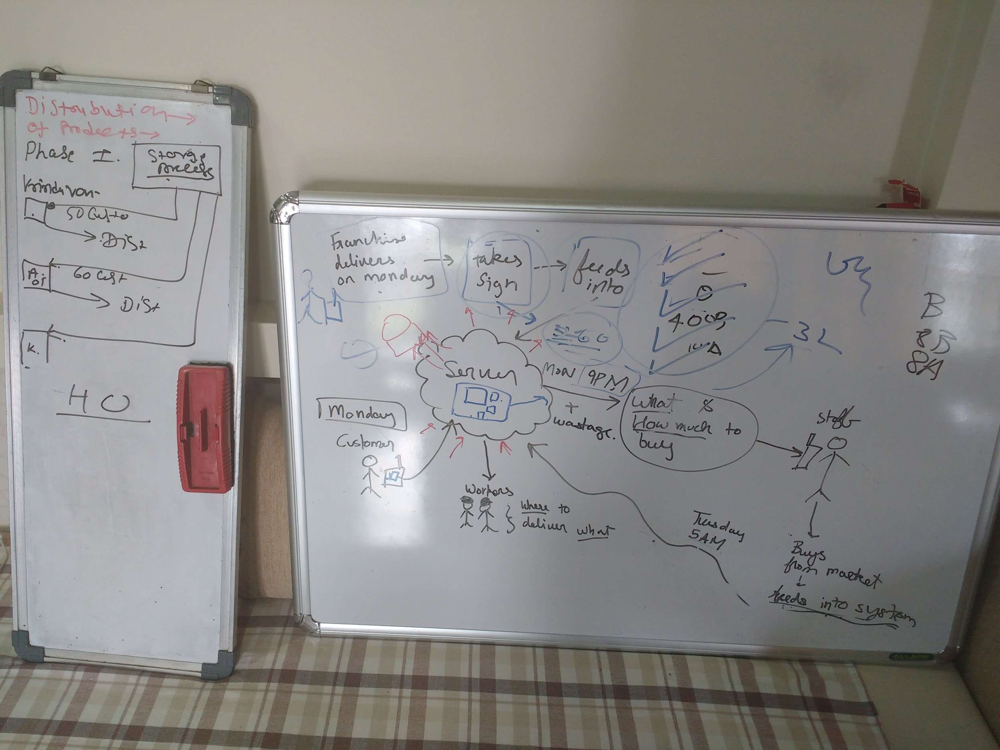

title: Day 07456 - Long discussion with dad
date: 2016-08-30

Today me and dad discussed about the state of current progress in India in the technology sector, especially startups. We discussed about businesses and how they make profit, how tactics such as easy ui/ux, customer satisfaction, marketing, advertising, etc are all important, but most of all the service provided is the key part to making something much more successful.

*explaining concepts and ideas*

After doing this lengthy discussion, I did a bit of research about Django, Django-oscar, and Iconic framework because I feel that to be able to make an android application with a decent backend API seems like a very valuable skill to have, and also works as a side hobby.

Rest of the time I played DotA.