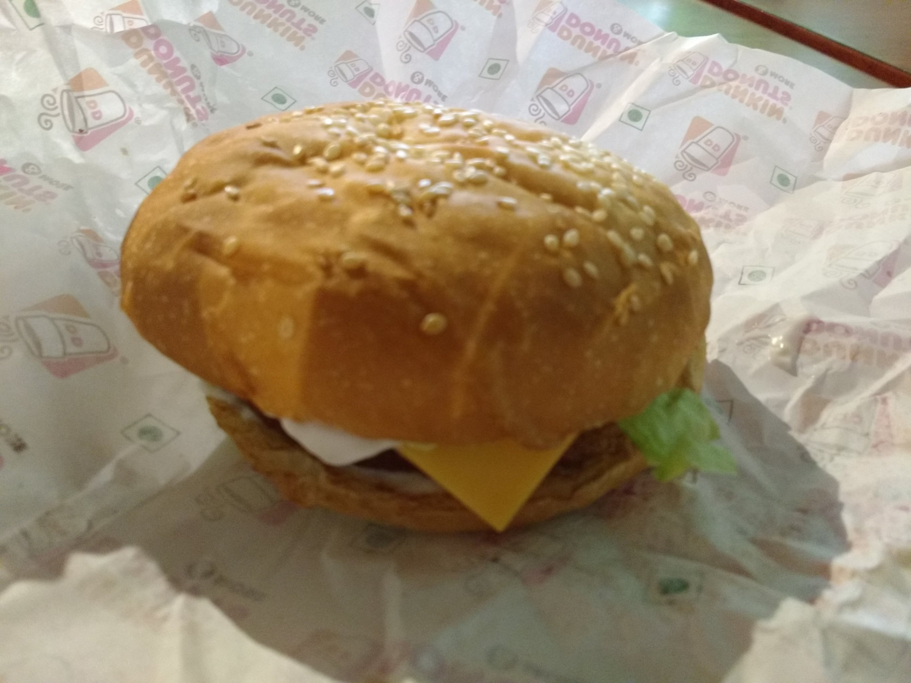

title: Simply Potato
date: 2016-08-04

I remembered some voice in my head echoing "Surprisinly dunkin donut burgers are damn tasty", and today finally I decided to get a quick bite.

There were a couple of veg burgers I could choose from, but I only had space for one. So I decided to go with a very non conventional burger, the 'Simply potato'. I usually always prefer burgers with lots of veggies or with paneer (cottage cheese), but oh well.

Item: Veg. Simply Potato burger

* Price: Rs. 120 + Rs 24 for cheese slice - 2/5
* Bread buns: Crumpled and flaky, but not very sweet - 3/5
* Potato patty: Hot. Nice crust. Strong taste. 3/5
* Mayonnaise: I was disappointed by the quantity. The picture on the menu portrayed an overwhelmingly excess amount of mayonnaise oozing out, which was understandable given it's relatively expensive price. 1.5/5
* Lettuce: Fresh, tasty but not crunchy. 3.5/5

Overall: 2.6/5

Pictures:

